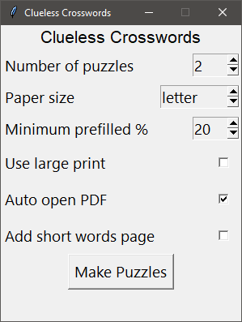

# Clueless Crosswords
This application makes printable clueless crossword puzzles in PDF format. Though they are meant to be printed, the PDF files do work well with tablets that allow handwriting such as an iPad or Surface.  

Pre-built binaries are available for Windows and macOS Catalina. Just unzip the one for your system and run.  

The options for the pdf are:
 - The number of puzzles per pdf (1 - 20)
 - The page size (letter or A4)
 - Puzzle font size (2 puzzles in portrait, or 1 large print puzzle in landscape)
 - The minimum percentage of blank tiles in the puzzle to be prefilled  (15% - 50%)
 - Option to print the list of 2 and 3 letter words used to make the puzzles

The GUI looks like:  


Other systems that can run Python 3.7 or higher should be able to simply run the script directly. The only limitation is that it may not be able to automatically open the resulting PDF. The only requirement is ReportLab which can be installed with
```
pip install reportlab
```

The application defaults to displaying a GUI. If you want to use it via the command line, simply specify at least one argument when run.
```
usage: CluelessCrosswords.py [-h] [-n NUMBER] [-w] [-o] [-a4] [-l]

optional arguments:
  -h, --help            show this help message and exit
  -n NUMBER, --number NUMBER
                        number of puzzles to make
  -w, --words           add a page with 2 & 3 letter words
  -o, --autoopen        open output pdf with default pdf handler
  -a4, -A4              switch to A4 sized paper
  -l, --largeprint      switch to large print
```

Replacing the word lists used is also possible. Both word list files are simply a gzipped pickled tuple. words.pkl.gz is the full list, and useful.pkl.gz is a smaller list with words that the application pulls from first. In this case, it is used to pick from words that have less common letters to make the puzzle more interesting.

More information about this app and clueless crosswords, as well as examples of the puzzles, is available [here](./docs/index.md).  
